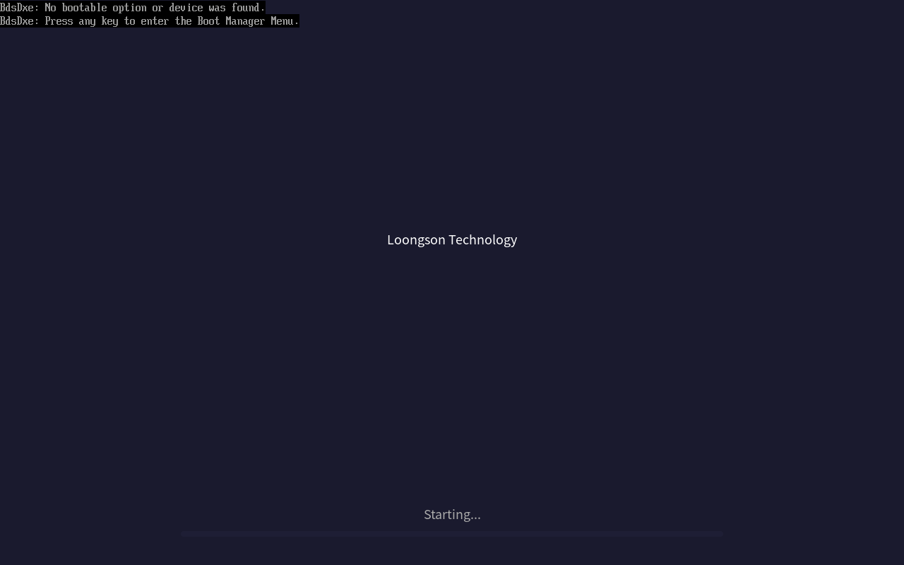
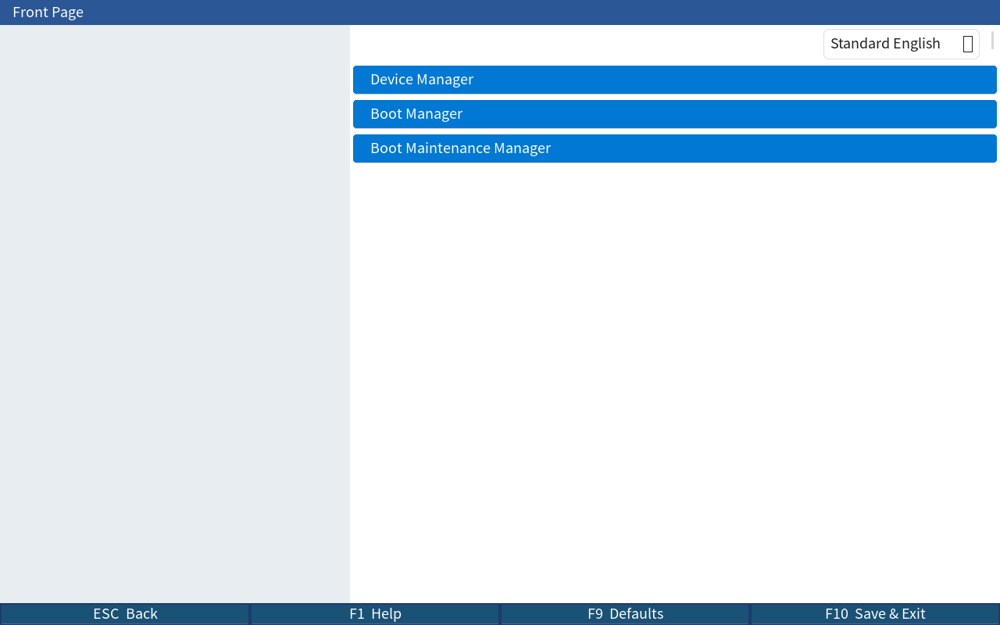
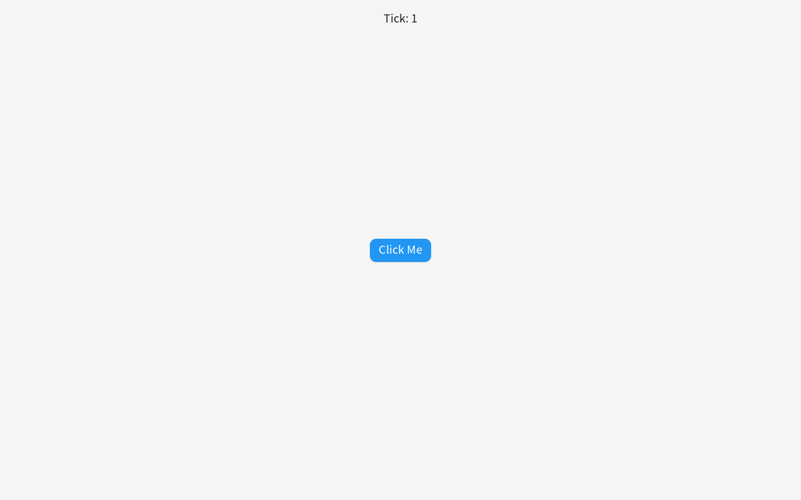
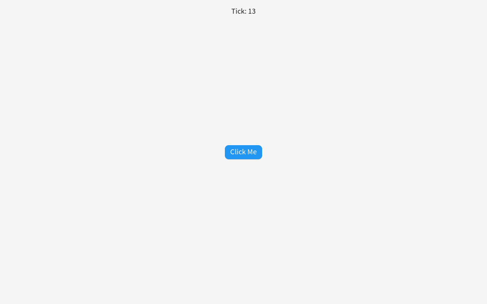

# EDK2 图形化 BIOS Setup UI — 设计与实现说明

> 基于 **lvgl v9.2.2**，在 OVMF (X64) 上实现图形化 UEFI BIOS Setup 界面。  
> 零侵入：所有修改仅限 DSC/FDF 替换，现有 EDK2 模块代码不变。  
> 分支：`ui`　作者：Loongson Technology

---

## 目录

1. [背景与目标](#背景与目标)
2. [架构总览](#架构总览)
3. [模块说明](#模块说明)
4. [QEMU 运行效果](#qemu-运行效果)
5. [启动流程与截图分析](#启动流程与截图分析)
6. [已知限制与后续工作](#已知限制与后续工作)
7. [构建方法](#构建方法)
8. [DSC/FDF 替换参考](#dscfdf-替换参考)

---

## 背景与目标

UEFI BIOS 的 Setup 界面长期依赖文本终端（`DisplayEngineDxe`），在高分辨率 GOP 屏幕上字体过小、交互体验差。龙芯产品线需要一套可定制的图形化 BIOS UI。

**目标：**
- 用 lvgl v9.x 替换 EDK2 内置文本 Setup 引擎
- 支持 CJK（中文）字符显示
- 零代码修改现有 EDK2 模块，DSC/FDF 一行替换即可生效
- 先在 OVMF/QEMU 上验证，再迁移到龙芯 LsFwSdk

---

## 架构总览

```
┌─────────────────────────────────────────────────────────┐
│                   EDK2 BDS/DXE Phase                    │
│                                                         │
│  BootLogoLib         →  GuiBootLogoLib                  │
│  (POST 进度条)            (lvgl 深蓝启动画面)            │
│                                                         │
│  DisplayEngineDxe    →  GuiDisplayEngineDxe             │
│  (文本 HII 表单)          (lvgl 双栏 Setup UI)           │
│                                                         │
│  BootManagerMenuApp  →  GuiBootManagerMenuApp           │
│  (文本启动菜单)            (lvgl 图形启动选择界面)        │
│                                                         │
│  ────────────────────────────────────────────────────── │
│                    LvglLib（共享库）                     │
│   GOP 显示后端 + 键盘/鼠标 indev + tick 源 + CJK 字库   │
│                    lvgl v9.2.2 submodule                 │
└─────────────────────────────────────────────────────────┘
```

**调用层次：**

```
UefiLvglInit()     — 初始化 lvgl、注册 GOP 显示、SimpleTextInputEx 键盘
UefiLvglTick()     — 驱动 lvgl 定时器、刷新帧缓冲
UefiLvglDeinit()   — 释放资源
```

所有图形模块通过 `LvglLib` 公开 API 使用 lvgl，互不干扰。

---

## 模块说明

### 1. LvglLib

**路径：** `MdeModulePkg/Library/LvglLib/`

| 文件 | 说明 |
|------|------|
| `lvgl/` | lvgl v9.2.2 git submodule |
| `lv_conf.h` | EDK2/UEFI 编译配置（禁用 OS 依赖、启用 CJK） |
| `port/lv_uefi_disp.c` | GOP 帧缓冲显示后端 |
| `port/lv_uefi_indev_kb.c` | SimpleTextInputEx 键盘输入适配器 |
| `port/lv_uefi_indev_ptr.c` | SimplePointer / AbsolutePointer 鼠标适配器 |
| `LvglLibInit.c` | `UefiLvglInit/Tick/Deinit` 公开 API 实现 |
| `fonts/lv_font_cjk_14.c` | NotoSansSC 14px，含 ASCII + CJK 0x4E00–0x55FF |
| `fonts/lv_font_cjk_18.c` | NotoSansSC 18px（默认字体） |

**公开头文件：** `MdeModulePkg/Include/Library/LvglLib.h`

```c
VOID   UefiLvglInit   (IN EFI_HANDLE ImageHandle, IN EFI_SYSTEM_TABLE *SystemTable);
VOID   UefiLvglTick   (VOID);   // 调用 lv_timer_handler() + gBS->Stall(5000)
VOID   UefiLvglDeinit (VOID);
```

---

### 2. GuiBootLogoLib

**路径：** `MdeModulePkg/Library/GuiBootLogoLib/`  
**替换：** `BootLogoLib|MdeModulePkg/Library/BootLogoLib/BootLogoLib.inf`

实现标准 `BootLogoLib` 接口：

| 函数 | 行为 |
|------|------|
| `BootLogoEnableLogo()` | 初始化 lvgl，渲染深蓝背景 + 厂商名 + 进度条 |
| `BootLogoUpdateProgress()` | 更新进度条值 + 标题文字 |
| `BootLogoDisableLogo()` | 析构 lvgl，释放 GOP |

UI 设计：
- 背景色 `#1A1A2E`（深蓝黑）
- 居中显示 "Loongson Technology"
- 底部 60% 宽、8px 高蓝色进度条（`#0078D4`）
- 进度文字标签（`#AAAAAA`）

---

### 3. GuiDisplayEngineDxe

**路径：** `MdeModulePkg/Universal/GuiDisplayEngineDxe/`  
**替换：** `MdeModulePkg/Universal/DisplayEngineDxe/DisplayEngineDxe.inf`

实现 `EDKII_FORM_DISPLAY_ENGINE_PROTOCOL`，将 HII IFR OpCode 映射为 lvgl 控件：

| IFR OpCode | lvgl 控件 |
|------------|-----------|
| `EFI_IFR_CHECKBOX_OP` | `lv_switch`（开关） |
| `EFI_IFR_NUMERIC_OP` | `lv_spinbox`（数字调节） |
| `EFI_IFR_ONE_OF_OP` | `lv_dropdown`（下拉选择） |
| `EFI_IFR_DATE_OP` | 三个 `lv_roller`（年/月/日滚轮） |
| `EFI_IFR_REF_OP` | `lv_button`（导航按钮，#0078D4） |

**布局（`Layout.c`）：**

```
┌─────────────────────────────────────────────────┐  32px
│  [Title]  FormTitle                   dropdown  │  ← 蓝色标题栏
├───────────────┬─────────────────────────────────┤
│               │                                 │
│  左侧导航树   │   右侧表单内容区                │
│   (35%)       │       (65%)                     │
│               │                                 │
├───────────────┴─────────────────────────────────┤  28px
│ [ESC Back] [F1 Help] [F9 Defaults] [F10 Save]   │  ← 深蓝状态栏
└─────────────────────────────────────────────────┘
```

色彩方案：

| 用途 | 颜色 |
|------|------|
| 背景 | `#F0F0F0` |
| 面板 | `#FFFFFF` |
| 标题栏 | `#2B5797` |
| 高亮/按钮 | `#0078D4` |
| 状态栏 | `#1E3A6E` |

---

### 4. GuiBootManagerMenuApp

**路径：** `MdeModulePkg/Application/GuiBootManagerMenuApp/`  
**替换：** `MdeModulePkg/Application/BootManagerMenuApp/BootManagerMenuApp.inf`  
**复用 FILE_GUID：** `EEC25BDC-67F2-4D95-B1D5-F81B2039D11D`（无需修改 `PcdBootManagerMenuFile`）

- 调用 `EfiBootManagerGetLoadOptions()` 获取所有启动项
- lvgl 列表渲染（深色主题，深蓝 `#2A2A3E` 条目，选中高亮 `#0078D4`）
- 键盘导航：↑↓ 选择，Enter 启动，Esc 退出
- 支持滚动（> 屏幕容量时自动 `lv_obj_scroll_to_view`）

---

## QEMU 运行效果

测试环境：

| 项目 | 值 |
|------|-----|
| 固件 | `Build/OvmfX64/DEBUG_GCC/FV/OVMF_CODE.fd` |
| 机器 | `-machine q35 -enable-kvm -m 512M` |
| QEMU | 8.2.2 |
| 构建工具链 | GCC (Ubuntu 24.04) |
| 分辨率 | 1280×800（QEMU VGA std） |

---

## 启动流程与截图分析

### 阶段 1：POST 启动画面（GuiBootLogoLib）

无启动磁盘时，`BootLogoEnableLogo()` 在 BDS 阶段被调用，渲染以下画面：



**观察：**
- 深蓝背景（`#1A1A2E`）✅
- 居中 "Loongson Technology" 白色标签 ✅
- 底部 "Starting..." 灰色文字 + 蓝色进度条 ✅
- 顶部两行文字为 BdsDxe 文本控制台输出（ConOut 混叠，见[已知限制](#已知限制与后续工作)）

---

### 阶段 2：BIOS Setup UI（GuiDisplayEngineDxe）

通过 Shell 直接执行 `UiApp.efi` 触发 GuiDisplayEngineDxe 渲染 HII 表单：



**观察：**
- 蓝色标题栏，左侧显示表单标题 "Front Page" ✅
- 右上角 `lv_dropdown` 渲染语言选择器 "Standard English" ✅
- 右侧面板三个蓝色圆角按钮，白色标签文字正确显示 ✅
  - **Device Manager** / **Boot Manager** / **Boot Maintenance Manager**
- 底部状态栏四按钮："ESC Back / F1 Help / F9 Defaults / F10 Save & Exit" ✅
- 左侧灰色导航面板（当前为空，待左侧树形导航功能填充）✅

---

### 阶段 3：P1 里程碑 Demo（LvglDemoApp）

Shell 运行 `LvglDemoApp.efi`，验证 lvgl 基础渲染和定时器：

| 启动时 (Tick: 1) | 运行 13 秒后 (Tick: 13) |
|:---:|:---:|
|  |  |

**观察：**
- "Tick: N" 标签每秒递增，验证 lvgl 定时器正常 ✅
- "Click Me" 蓝色圆角按钮 (`lv_button`) 正常渲染 ✅
- GOP 帧缓冲输出正常，文字抗锯齿清晰 ✅

---

## 已知限制与后续工作

### 限制 1：BdsDxe ConOut 混叠

**现象：** GuiBootLogoLib 启动画面上叠加了 BdsDxe 的文本控制台输出  
（`"BdsDxe: No bootable option or device was found."`）

**原因：** OVMF 的 `PlatformBootManagerLib` 在调用 `BootLogoEnableLogo()` 之前已启用文本 ConOut。两者均写入 GOP 帧缓冲，产生混叠。

**修复方案（未实现）：**
```c
// 在 GuiBootLogoLib 初始化后临时隐藏文本控制台光标
gST->ConOut->EnableCursor(gST->ConOut, FALSE);
gST->ConOut->ClearScreen(gST->ConOut);
```
或在平台 `PlatformBootManagerBeforeConsole()` 中仅连接 GOP，不连接文本 ConOut。

---

### ~~限制 2：REF_OP 按钮无标签~~ ✅ 已修复

`WidgetFactory.c` 已更新：`EFI_IFR_REF_OP` 按钮现在通过 `SetLabelFromHiiString()` 读取 HII 字符串并添加白色 `lv_label` 子控件。截图 `10_bios_setup_with_labels.png` 显示 "Device Manager / Boot Manager / Boot Maintenance Manager" 标签正确渲染。

---

### 限制 3：GuiBootManagerMenuApp 未截图

**现象：** 无磁盘时 OVMF 停在 "Press any key" 提示，未自动进入 GuiBootManagerMenuApp

**原因：** OVMF 的 `PlatformBootManagerLibLight` 打印提示后等待用户按键，未直接调用 `EfiBootManagerGetBootManagerMenu()`

**触发方式：** 在 UEFI Shell 中执行 `bcfg boot` 添加启动项后退出，或修改 OVMF 平台库调用 `EfiBootManagerCallBootManagerMenu()`

---

### 后续 Roadmap

| 优先级 | 任务 |
|--------|------|
| P1 | 修复 REF_OP 按钮标签缺失 |
| P1 | 左侧导航树（当前页面高亮） |
| P2 | 触发 GuiBootManagerMenuApp 截图验证 |
| P2 | 消除 ConOut/GOP 混叠（POST 阶段隐藏文本控制台） |
| P2 | STRING_OP、PASSWORD_OP 控件实现（当前返回 NULL） |
| P3 | 鼠标点击事件回调（当前键盘导航） |
| P3 | 龙芯 LsFwSdk 实机测试 |

---

## 构建方法

```bash
# 1. 配置 EDK2 环境
cd /path/to/edk2
source edksetup.sh

# 2. 构建完整 OVMF（包含所有 GUI 模块）
build -p OvmfPkg/OvmfPkgX64.dsc -a X64 -t GCC -b DEBUG

# 3. 单模块增量构建
build -p MdeModulePkg/MdeModulePkg.dsc -a X64 -t GCC -b DEBUG \
      -m MdeModulePkg/Universal/GuiDisplayEngineDxe/GuiDisplayEngineDxe.inf

# 4. QEMU 运行（带监视器截图）
qemu-system-x86_64 \
    -machine q35 -enable-kvm -m 512M \
    -drive if=pflash,format=raw,readonly=on,file=Build/OvmfX64/DEBUG_GCC/FV/OVMF_CODE.fd \
    -drive if=pflash,format=raw,file=Build/OvmfX64/DEBUG_GCC/FV/OVMF_VARS.fd \
    -drive format=raw,file=fat:rw:testfs \
    -vga std -display none \
    -monitor unix:/tmp/qemu-mon.sock,server,nowait \
    -serial file:/tmp/serial.log &

# 截图
python3 -c "
import socket, time
s = socket.socket(socket.AF_UNIX, socket.SOCK_STREAM)
s.connect('/tmp/qemu-mon.sock')
s.settimeout(3)
try: s.recv(4096)
except: pass
s.sendall(b'screendump /tmp/shot.ppm\n')
time.sleep(0.4)
s.close()
"
ffmpeg -i /tmp/shot.ppm shot.png
```

---

## DSC/FDF 替换参考

### OvmfPkgX64.dsc（三处改动）

```diff
 [LibraryClasses]
-  BootLogoLib|MdeModulePkg/Library/BootLogoLib/BootLogoLib.inf
+  BootLogoLib|MdeModulePkg/Library/GuiBootLogoLib/GuiBootLogoLib.inf
+  LvglLib|MdeModulePkg/Library/LvglLib/LvglLib.inf

 [Components]
-  MdeModulePkg/Universal/DisplayEngineDxe/DisplayEngineDxe.inf
+  MdeModulePkg/Universal/GuiDisplayEngineDxe/GuiDisplayEngineDxe.inf

-  MdeModulePkg/Application/BootManagerMenuApp/BootManagerMenuApp.inf
+  MdeModulePkg/Application/GuiBootManagerMenuApp/GuiBootManagerMenuApp.inf
```

### OvmfPkgX64.fdf（两处改动）

```diff
-INF  MdeModulePkg/Universal/DisplayEngineDxe/DisplayEngineDxe.inf
+INF  MdeModulePkg/Universal/GuiDisplayEngineDxe/GuiDisplayEngineDxe.inf

-INF  MdeModulePkg/Application/BootManagerMenuApp/BootManagerMenuApp.inf
+INF  MdeModulePkg/Application/GuiBootManagerMenuApp/GuiBootManagerMenuApp.inf
```

> LoongArchVirtQemu.dsc/.fdf 已同步应用相同替换，见分支 `ui` 最后一个提交。

---

## 代码统计

```
新增模块                               行数
─────────────────────────────────────────
MdeModulePkg/Library/LvglLib/          ~1500  (不含 lvgl submodule)
MdeModulePkg/Library/GuiBootLogoLib/     ~115
MdeModulePkg/Universal/GuiDisplayEngineDxe/  ~650
MdeModulePkg/Application/LvglDemoApp/    ~60
MdeModulePkg/Application/GuiBootManagerMenuApp/  ~185
fonts/lv_font_cjk_14.c + lv_font_cjk_18.c   ~80000 (生成)
─────────────────────────────────────────
手写代码合计（不含字库）              ~2510 行
DSC/FDF 修改行数                          ~12 行
现有模块代码修改                           0 行
```

---

*文档生成时间：2026-05-24　　测试平台：QEMU 8.2.2 / OVMF DEBUG_GCC / Ubuntu 24.04*
